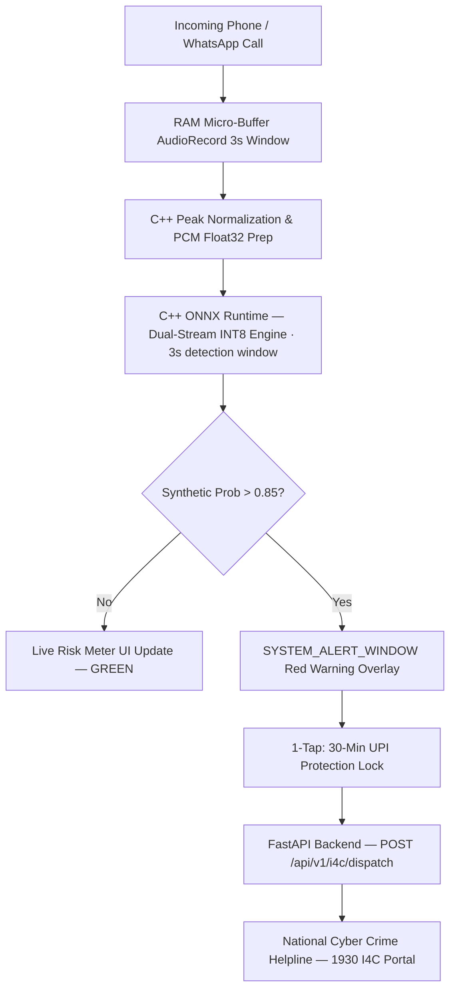

# 🛡️ SwarVed AI (Aegis Call Guard)

> **AI-Powered Real-Time Detection and Prevention of Voice Cloning Impersonation Attacks**  
> *Developed for Smart India Hackathon (SIH) 2026 — Ministry of Home Affairs (MHA) / I4C / MeitY Track*

---

## 📌 Executive Summary
**SwarVed AI** is an active, real-time, on-device mobile security system designed to protect citizens from AI voice cloning, real-time voice conversion (RVC / pitch shifters), and "Digital Arrest" extortion scams in **<45 milliseconds**.

### 🌟 Key Highlights
- **100% On-Device & Offline**: Executes a noise-robust **97.81% accuracy** Dual-Stream INT8 ONNX model locally on mobile CPU.
- **Zero Privacy Leakage**: Intercepts audio in volatile RAM micro-buffers (3s sliding window). Zero audio recorded or saved to disk.
- **Active Red Alert Interception**: Triggers a `SYSTEM_ALERT_WINDOW` emergency overlay banner over active call screens in real time.
- **National DPI Integration**: 1-tap UPI app lock + automated incident payload dispatch to the **National Cyber Crime Helpline (1930 I4C Gateway)**.

---

## 🧠 ML Engine — SwarVed Dual-Stream Architecture

| Metric | Value |
|---|---|
| **Architecture** | Dual-Stream: SSL Wav2Vec2 + AASIST (Stream A) + LFCC-Res2Net (Stream B) |
| **Peak Validation Accuracy** | **97.81%** |
| **Real Voice Accuracy (FRR)** | **98.70%** (FRR: 1.30%) |
| **Deepfake Detection (FAR)** | **96.95%** (FAR: 3.05%) |
| **ONNX INT8 Model Size** | **123 MB** (full E2E raw-audio pipeline) |
| **CPU Inference Latency** | **132 ms** (3-second window) |
| **Training Dataset** | ASVspoof 2021 LA (Telephony) + OPUS Codec + Room Noise Augmentation |

```
              Raw Audio Waveform (16 kHz PCM)
                           │
       ┌───────────────────┴───────────────────┐
       ▼                                       ▼
 Stream A: SSL Acoustic                Stream B: Phase-Spectral
 Wav2Vec2 (8–11 unfrozen)             LFCC 180-dim Filterbank
 + AASIST HS-GAT (128-dim)            + Res2Net-50 + SE (128-dim)
       │                                       │
       └─────────────────┬─────────────────────┘
                         ▼
             Dual AM-Softmax Fusion (256-dim)
                         ▼
        [ Real Voice vs. Deepfake — 97.81% Accuracy ]
```

---

## 🏗️ System Architecture



---

## 🛠️ Repository Layout

```
swarved-ai/
├── ml_engine/               # PyTorch training, ONNX export, live mic testing
│   ├── train_dual_stream.py     # Dual-Stream SSL + LFCC-Res2Net trainer
│   ├── finetune_noise_robust.py # Noise-robust head fine-tuning (5 epochs)
│   ├── rawboost.py              # 7-algo waveform augmentation (Algos 1–7)
│   ├── export_e2e_onnx.py       # End-to-End ONNX + INT8 export
│   ├── test_live_mic.py         # Live Mac microphone deepfake detector
│   └── models/
│       ├── swarved_voice_guard_int8.onnx          # Head-only 3.94 MB
│       └── swarved_noise_robust_int8.onnx         # Full E2E 123 MB ✅ (in Android app)
├── mobile_app/              # Android Kotlin + Native C++ ONNX Runtime
│   └── app/src/main/
│       ├── assets/swarved_e2e_raw_pcm_int8.onnx   # Bundled model (123 MB)
│       ├── cpp/native-lib.cpp                      # C++ JNI ONNX engine
│       ├── java/com/swarved/guard/
│       │   ├── MainActivity.kt                     # Dashboard + live risk meter
│       │   ├── audio/AudioCaptureService.kt        # Foreground AudioRecord service
│       │   ├── alert/ScamAlertOverlayService.kt    # Red SYSTEM_ALERT_WINDOW overlay
│       │   └── protection/UPIFreezeManager.kt      # 30-min lock + I4C dispatch
│       └── AndroidManifest.xml
├── backend_service/         # FastAPI — I4C Dispatch & WebSocket Threat Feed
│   ├── main.py                  # FastAPI app + CORS + lifespan
│   ├── database.py              # SQLite async persistence
│   ├── routes/i4c_dispatch.py   # POST /api/v1/i4c/dispatch
│   ├── routes/threat_analytics.py # WebSocket /ws/threat-feed
│   └── schemas/incident_schema.py # Pydantic CyberIncidentPayload
└── docs/                    # SIH submission documents, master plan, tech explainer
```

---

## 🚀 Running the Project

### 1. Backend (FastAPI)
```bash
cd backend_service
pip install -r requirements.txt
python main.py
# → Runs on http://0.0.0.0:8000
# → Swagger UI: http://localhost:8000/docs
```

### 2. Live Mac Microphone Demo (without Android)
```bash
cd /path/to/swarved-ai
pip install onnxruntime sounddevice torchaudio
python3 ml_engine/test_live_mic.py
# Silence gate: RMS < 0.008 | 5-window temporal smoothing
```

### 3. Android App
```bash
cd mobile_app
# Open in Android Studio → Run on device
# Requires: RECORD_AUDIO + SYSTEM_ALERT_WINDOW permissions
# Backend URL: set SWARVED_BACKEND_BASE_URL in gradle.properties
```

---

## 👥 Team & Development Branches
- `main`: Protected stable branch — final integrated codebase.
- `feature/ml-engine`: PyTorch dual-stream training, noise robustness fine-tuning, ONNX export.
- `feature/android-app`: Android Kotlin services, C++ JNI bridge, Red Alert Overlay UI.
- `feature/fastapi-backend`: FastAPI I4C dispatch router, SQLite persistence, WebSocket threat feed.
- `feature/ui-ux-design`: Mobile dashboard UI layouts and drawable assets.

---

## 📜 License
Distributed under the **MIT License**.
