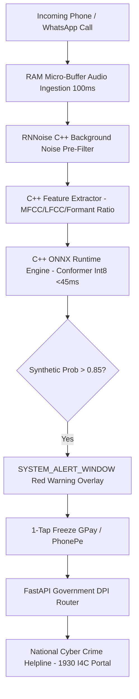

# 🛡️ SwarVed AI (Aegis Call Guard)

> **AI-Powered Real-Time Detection and Prevention of Voice Cloning Impersonation Attacks**  
> *Developed for Smart India Hackathon (SIH) 2026 — Ministry of Home Affairs (MHA) / I4C / MeitY Track*

---

## 📌 Executive Summary
**SwarVed AI** is an active, real-time, on-device mobile security system designed to protect citizens from AI voice cloning, real-time voice conversion (RVC / pitch shifters), and "Digital Arrest" extortion scams in **<45 milliseconds**.

### 🌟 Key Highlights
- **100% On-Device & Offline**: Executes a 12.4 MB Int8 quantized Conformer ONNX model locally on mobile CPU/NPU memory.
- **Zero Privacy Leakage**: Intercepts audio in volatile RAM micro-buffers (0.1s sliding window). Zero audio recorded or saved to disk.
- **Active Red Alert Interception**: Triggers a `SYSTEM_ALERT_WINDOW` emergency overlay banner over active call screens.
- **National DPI Integration**: 1-tap UPI app lock + automated incident payload dispatch to the **National Cyber Crime Helpline (1930 I4C Gateway)**.

---

## 🏗️ System Architecture

---

## 🛠️ Repository Layout
- `ml_engine/`: PyTorch Conformer model, feature extraction (`extract_features.py`), and Int8 ONNX export script.
- `mobile_app/`: Android Kotlin background audio service, native C++ JNI bridge (`native-lib.cpp`), and Red Overlay UI.
- `backend_service/`: FastAPI microservice handling 1930 Helpline dispatch payloads (`/api/v1/i4c/dispatch`).
- `docs/`: Official SIH presentation deck, master execution plan, architecture diagrams, and team role guide.

---

## 👥 Team & Development Branches
- `main`: Protected stable base branch.
- `feature/ml-engine`: PyTorch model training, feature extraction, and Int8 ONNX quantization.
- `feature/android-app`: Android Kotlin services, C++ JNI bridge, and Red Alert Overlay UI.
- `feature/fastapi-backend`: FastAPI 1930 Cyber Crime Helpline dispatch router & WebSockets feed.
- `feature/ui-ux-design`: Mobile dashboard UI layouts and architecture graphic assets.

---

## 📜 License
Distributed under the **MIT License**.
