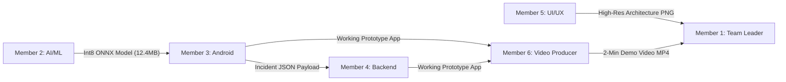

# 🚀 SwarVed AI: Complete Team Roles & Detailed Execution Guide

> **This is the official master task delegation guide for SwarVed AI (SIH 2026). Each team member MUST read their assigned role carefully. It defines your exact responsibilities, tools, outputs, day-by-day roadmap, and acceptance criteria for our 7-day sprint.**

---

## 📋 Quick Team Assignment Overview

| Member | Role Title | Core Technical Domain | Primary Output Artifact |
| :--- | :--- | :--- | :--- |
| **Member 1 (TL)** | **Team Leader & Pitch Strategy Lead** | Leadership, SIH Presentation, Pitch Defense | Official 6-Slide PPT & Abstract PDF |
| **Member 2** | **AI/ML Lead** | Deep Learning, Signal Processing, ONNX | `swarved_voice_guard_int8.onnx` (12.4 MB) |
| **Member 3** | **Android / Systems Lead** | Android Kotlin, C++ JNI, Audio Services | Android App APK + C++ ONNX Engine |
| **Member 4** | **Full-Stack & DPI Lead** | FastAPI Backend, Government 1930 API, UPI Lock | FastAPI Backend Server + `/dispatch` API |
| **Member 5** | **UI/UX & Frontend Lead** | Mobile UI (Flutter/Android), Architecture Diagrams | Mobile Dashboard UI & High-Res Diagram PNGs |
| **Member 6** | **Docs & Video Producer** | Media Production, QA Testing, Submission Pack | 2-Min Demo Video (`.mp4`) & Test Report |

---

## 👑 Member 1: Team Leader & Pitch Strategy Lead (YOU)

### 🎯 Primary Responsibilities:
You are responsible for driving overall project execution, keeping all 6 team members on schedule, writing the official SIH pitch deck, drafting the solution abstract, and delivering the winning 30-second stage presentation.

### 🛠️ Tools & Stack:
- Microsoft PowerPoint / Canva
- LaTeX / Markdown PDF Generator (for Abstract)
- GitHub Project Board / Trello / Notion

### 📦 What You Exactly Need to Create (Deliverables):
1. **Official 6-Slide SIH Presentation Deck (`SIH2026_IDEA_Presentation_SwarVedAI.pptx`)**:
   - Slide 1: Title & Team Details (PS Code, Sponsoring Ministry MHA/I4C).
   - Slide 2: Problem Statement & Root Cause (Statistical loss data, why Truecaller fails).
   - Slide 3: Proposed Solution & System Architecture (High-res diagram embed).
   - Slide 4: Innovation & Unfair Moat (On-device <45ms C++ engine vs. 5s cloud lag).
   - Slide 5: Technical Stack, Security & Scalability (12.4MB ONNX, zero-data-leakage RAM model).
   - Slide 6: Team Competency & Rollout Plan.
2. **Official One-Page Solution Abstract PDF (`SIH2026_SwarVedAI_OnePage_Abstract.pdf`)**.
3. **The 30-Second Stage Live Pitch Script**.
4. **Final Submissions Pack** to College SPOC / SIH Submission Portal.

### 📅 Day-by-Day Action Plan:
- **Day 1**: Lock API contracts between Android (M3) and Backend (M4). Create Git repository.
- **Day 2**: Collect problem statistics & literature data on AI voice scams for Slide 2 of PPT.
- **Day 3**: Draft Slide 1, 2, and 4 of presentation deck. Review M2's ONNX model progress.
- **Day 4**: Embed Member 5’s high-resolution Architecture Diagram into Slide 3.
- **Day 5**: Draft the 1-Page Official Abstract PDF. Review working prototype build.
- **Day 6**: Finalize all 6 slides of the PPT deck. Write and practice stage pitch script.
- **Day 7**: Conduct 3 full live demo dress rehearsals with the team. Submit complete package to SPOC.

---

## 🧠 Member 2: AI/ML Lead (Deep Learning & Model Quantization)

### 🎯 Primary Responsibilities:
You are responsible for dataset collection, building the signal feature extraction pipeline (MFCC, LFCC, Formant Ratios, Bispectrum), training the Conformer PyTorch classifier, and quantizing it to a lightweight **12.4 MB Int8 ONNX model**.

### 🛠️ Tools & Stack:
- Python 3.10+, PyTorch, Torchaudio
- ONNX Runtime (`onnxruntime`, `onnxruntime.quantization`)
- Librosa, Scipy, NumPy

### 📦 What You Exactly Need to Create (Deliverables):
1. **`extract_features.py`**: Audio feature extraction module generating 1x80x128 matrices:
   - MFCC (20 coefficients for vocal tract geometry).
   - LFCC (30 coefficients for high-frequency vocoder glitches >3.4kHz).
   - Formant Ratio Discontinuity ($F_2/F_1$ mismatch for voice-changer apps).
   - Bispectrum & $F_0$ Pitch Contour Variance.
2. **`train_conformer.py`**: PyTorch Conformer-Small binary classifier training script.
3. **`export_onnx.py`**: Script converting PyTorch model (`conformer_best.pt`) to Int8 Quantized ONNX (`swarved_voice_guard_int8.onnx`).
4. **Output Binary**: **`swarved_voice_guard_int8.onnx`** (Must be <15 MB in size!).

### 📅 Day-by-Day Action Plan:
- **Day 1**: Pre-download audio datasets (ASVspoof 2021 LA, WaveFake, ElevenLabs samples, RVC converted samples).
- **Day 2**: Implement `extract_features.py` (MFCC + LFCC + Formant + Bispectrum extractor).
- **Day 3**: Train Conformer PyTorch classifier (`train_conformer.py`) for 20 epochs until validation accuracy >97%.
- **Day 4**: Write and run `export_onnx.py`. Perform Int8 dynamic quantization (`quantize_dynamic`).
- **Day 5**: Validate inference speed (<45ms per frame) and hand over `swarved_voice_guard_int8.onnx` to Member 3 (Android Lead).
- **Day 6**: Help Member 6 verify edge-case audio samples (poor cellular signal, speakerphone noise).
- **Day 7**: Document model metrics (Accuracy, Precision, Recall, Inference Time) for Slide 5 of PPT.

---

## 📱 Member 3: Android & Systems Lead (Native C++ JNI & Mobile Services)

### 🎯 Primary Responsibilities:
You are responsible for building the Android application, creating the volatile RAM micro-buffer audio stream service (`AudioCaptureService.kt`), writing the C++ JNI ONNX Runtime bridge (`native-lib.cpp`), and building the Red Emergency Alert Overlay (`ScamAlertOverlayService.kt`).

### 🛠️ Tools & Stack:
- Android Studio, Kotlin, Android NDK (C++17, CMake)
- ONNX Runtime C++ API (`onnxruntime-android`)
- RNNoise C++ Recurrent Noise Suppressor

### 📦 What You Exactly Need to Create (Deliverables):
1. **`native-lib.cpp`**: Native C++ JNI bridge loading `swarved_voice_guard_int8.onnx` via ONNX Runtime C++ API and running inference on PCM audio buffers in **<45 milliseconds**.
2. **`AudioCaptureService.kt`**: Background service reading 100ms micro-buffers from 16kHz PCM audio stream in volatile RAM without saving files to disk.
3. **`ScamAlertOverlayService.kt`**: System alert window (`TYPE_APPLICATION_OVERLAY`) displaying a high-priority bright **RED EMERGENCY BANNER** when `synthetic_prob > 0.85`.
4. **`UPIFreezeManager.kt`**: 1-Tap button logic that simulates locking UPI payment apps (GPay/PhonePe) for 30 minutes and triggers dispatch to Member 4's backend.

### 📅 Day-by-Day Action Plan:
- **Day 1**: Initialize Android project structure, configure NDK, `CMakeLists.txt`, and permissions (`SYSTEM_ALERT_WINDOW`, `RECORD_AUDIO`).
- **Day 2**: Build `AudioCaptureService.kt` to capture 100ms PCM audio frames into volatile memory.
- **Day 3**: Implement `native-lib.cpp` (ONNX Runtime C++ API initialization & `runInference` JNI function).
- **Day 4**: Connect `AudioCaptureService.kt` output to `native-lib.cpp`. Receive model probability score in real-time.
- **Day 5**: Implement `ScamAlertOverlayService.kt` (Red Warning Overlay UI). Trigger overlay when probability >0.85.
- **Day 6**: Connect 1-Tap button in overlay to POST incident JSON payload to Member 4's backend endpoint.
- **Day 7**: Grant all permissions on demo phones. Perform live test with Member 1 & Member 6.

---

## ⚡ Member 4: Full-Stack & DPI Integrations Lead (FastAPI & Government Backend)

### 🎯 Primary Responsibilities:
You are responsible for building the FastAPI microservice backend, implementing the National Cyber Crime Helpline (1930 I4C Portal) dispatch router, and managing threat analytics.

### 🛠️ Tools & Stack:
- Python 3.10+, FastAPI, Pydantic, Uvicorn
- SQLite / PostgreSQL
- WebSockets (for live dashboard feed)

### 📦 What You Exactly Need to Create (Deliverables):
1. **`main.py`**: FastAPI application entry point.
2. **`schemas/incident_schema.py`**: Pydantic models for `CyberIncidentPayload` (Incident ID, Timestamp, Caller ID, Audio Fingerprint Hash, GPS, Probability).
3. **`routes/i4c_dispatch.py`**: POST `/api/v1/i4c/dispatch` endpoint that receives mobile alerts and simulates dispatching to the 1930 Helpline gateway with an official reference ID (`I4C-2026-XXXX`).
4. **`routes/threat_analytics.py`**: GET endpoints returning incident history and threat maps.
5. **Localhost Server Setup**: Configured Uvicorn server (`http://192.168.x.x:8000`) ready to run on a local mobile hotspot during venue demos.

### 📅 Day-by-Day Action Plan:
- **Day 1**: Agree on JSON payload schema with Member 3 (Android Lead). Setup FastAPI project skeleton.
- **Day 2**: Implement `incident_schema.py` and SQLite database connection.
- **Day 3**: Build `i4c_dispatch.py` router with mock 1930 helpline dispatch response.
- **Day 4**: Implement WebSockets live threat feed for real-time dashboard updates.
- **Day 5**: Test POST requests from Android app (Member 3) to FastAPI backend over local hotspot network.
- **Day 6**: Build simple web analytics dashboard showing reported scam calls on a map.
- **Day 7**: Perform backend stress testing. Ensure zero crashes during live call presentations.

---

## 🎨 Member 5: UI/UX & Mobile Dashboard Lead (Design & Architecture Diagrams)

### 🎯 Primary Responsibilities:
You are responsible for designing the mobile app's user interface (Dark Mode Dashboard, Threat Risk Meter, Incident History Screen) and creating high-resolution system architecture diagrams for Slide 3 of the presentation deck.

### 🛠️ Tools & Stack:
- Figma / Penpot
- Flutter / Kotlin XML
- Draw.io / Mermaid.js / Illustrator

### 📦 What You Exactly Need to Create (Deliverables):
1. **Mobile App Dashboard UI**:
   - Home Screen: Real-Time Protection Status (Active Guard Shield), Risk Score Meter.
   - Incident History Screen: List of recent intercepted calls with timestamp, caller ID, and AI probability.
   - Emergency Settings Screen: UPI Freeze timer options, emergency contacts.
2. **High-Resolution System Architecture Diagram (`System_Architecture_Diagram.png`)**:
   - Professional SVG/PNG diagram illustrating: Incoming Audio Stream $\rightarrow$ C++ ONNX Local Engine $\rightarrow$ Red Alert Overlay $\rightarrow$ FastAPI 1930 Dispatch.
3. **Slide Graphics & Visual Assets** for Member 1’s presentation deck.

### 📅 Day-by-Day Action Plan:
- **Day 1**: Design high-fidelity wireframes in Figma for Mobile Dashboard & Red Alert Overlay.
- **Day 2**: Draft preliminary System Architecture Diagram in Draw.io / Mermaid.
- **Day 3**: Implement Mobile Dashboard layout in Flutter / Kotlin XML (Home Screen + Risk Meter).
- **Day 4**: Refine System Architecture Diagram into high-res PNG for Slide 3 of the PPT.
- **Day 5**: Connect UI screens with Member 3's backend service data (Incident History List).
- **Day 6**: Apply dark-mode aesthetic polish, custom icons, and smooth transitions.
- **Day 7**: Review final UI presentation on demo mobile phone with Member 1.

---

## 🎥 Member 6: Documentation & Video Producer (Media & Abstract Lead)

### 🎯 Primary Responsibilities:
You are responsible for recording and editing the official **2-Minute Prototype Video Walkthrough**, formatting project documentation, and conducting edge-case QA testing.

### 🛠️ Tools & Stack:
- OBS Studio / Mobile Screen Recorder
- Premiere Pro / DaVinci Resolve / CapCut
- Audacity (Audio voiceover recording)
- Markdown / PDF Converters

### 📦 What You Exactly Need to Create (Deliverables):
1. **2-Minute Official Demo Video (`SIH2026_SwarVedAI_Demo_Walkthrough.mp4`)**:
   - 0:00 - 0:30: Problem statement (AI Voice Cloning & Digital Arrest Scam demo).
   - 0:30 - 1:15: Live prototype demo (Scam call triggered $\rightarrow$ 1.5s Red Alert screen pops up $\rightarrow$ 1-Tap UPI lock).
   - 1:15 - 1:45: Backend 1930 Cyber Police dispatch proof & system architecture overview.
   - 1:45 - 2:00: Impact & Scalability summary.
2. **QA Edge-Case Test Report**: Validation results for poor cellular signal, street noise, and voice changer tests.
3. **Abstract Formatting**: Formatting Member 1's text into an official PDF document.

### 📅 Day-by-Day Action Plan:
- **Day 1**: Setup screen recording software (OBS Studio) and test video capture from mobile phone mirror.
- **Day 2**: Format Member 1’s abstract draft into a clean, single-page PDF template.
- **Day 3**: Write the script for the 2-minute prototype video walkthrough.
- **Day 4**: Conduct edge-case QA testing (simulate speakerphone noise, poor signal) and log results.
- **Day 5**: Record raw footage of the working mobile app prototype (call trigger $\rightarrow$ red alert $\rightarrow$ UPI lock).
- **Day 6**: Edit the 2-minute demo video (add captions, professional voiceover, and highlight boxes).
- **Day 7**: Render final 1080p MP4 video. Verify video size (<50MB) and package final submission zip.

---

## 🤝 Inter-Team Dependencies Map

1. **Member 2 $\rightarrow$ Member 3**: Member 2 hands over `swarved_voice_guard_int8.onnx` by Day 4 so Member 3 can load it into C++.
2. **Member 3 $\leftrightarrow$ Member 4**: Member 3 and Member 4 agree on JSON payload schema on Day 1. Member 3 POSTs alerts to Member 4's FastAPI backend.
3. **Member 5 $\rightarrow$ Member 1**: Member 5 delivers high-res Architecture Diagram PNG by Day 4 for Slide 3 of the PPT.
4. **Member 3 & 4 $\rightarrow$ Member 6**: Working mobile app & backend handed to Member 6 by Day 5 for video recording.
5. **Member 6 $\rightarrow$ Member 1**: Member 6 delivers the final 2-minute demo video MP4 to Member 1 on Day 7 for final submission.
