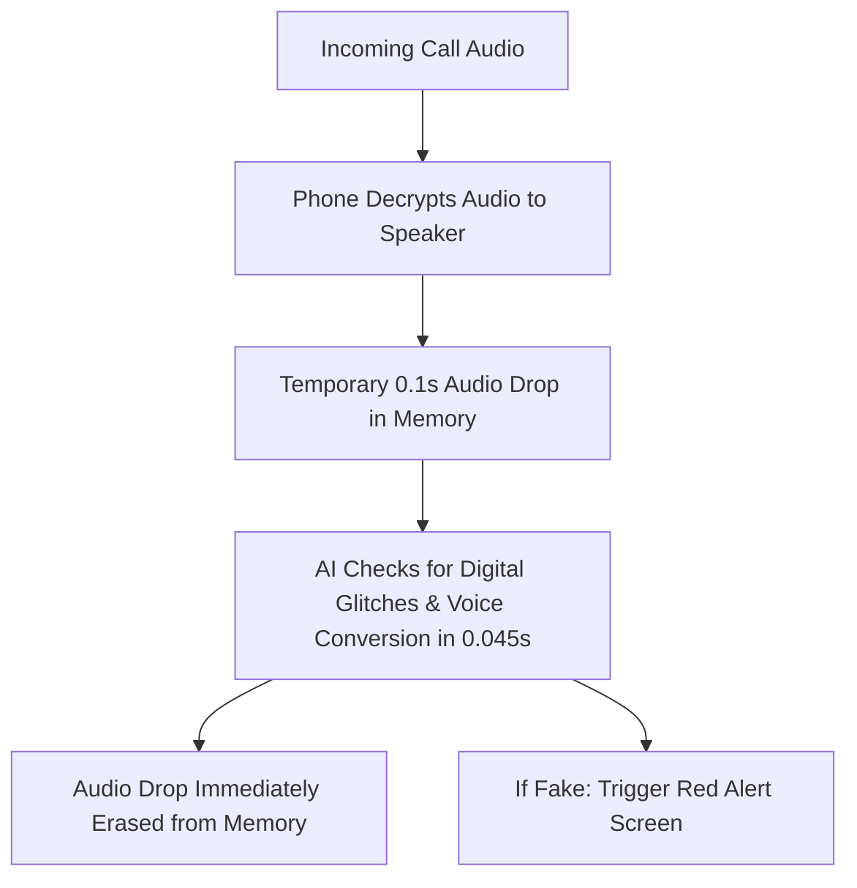

# 🗣️ SwarVed AI: Technical Architecture & System Guide

> **Official Team Architecture Brief: Explains system workflow, AI engine mechanics, edge-case engineering, and real-world failure mode mitigations.**

---

## 📌 Executive Summary
**SwarVed AI** is an active call protection system on your phone. When a scammer calls using a fake AI cloned voice, a voice-changer app, or **male-to-male voice conversion cloning a father's voice** (*"Beta, urgent ₹50,000 sent karo"*), our app detects that the voice is fake within **1.5 seconds**, flashes a RED WARNING on the screen, locks payment apps temporarily, and reports the scammer to the government cyber helpline (1930).

Here is how each component of technology functions:

---

## 1. How the App Listens Without Recording (The Water Pipe Analogy)

### ❓ The Common Concern:
*"Are we recording people's calls or violating privacy?"*

### 💡 Explanation:
Imagine a stream of water flowing through a pipe to your phone's speaker so you can hear the caller. 

- **Traditional Recording Apps**: They build a huge storage tank and store all the water (saving `.mp3` call recordings onto the phone storage). This violates privacy and takes up space.
- **Our SwarVed AI App**: Our app sits right next to the speaker pipe. It takes a **single drop of water (0.1 seconds of audio)** in RAM memory, checks if the drop has digital AI glitches, and **throws the drop away immediately**.
- **Result**: Zero audio is ever saved. Zero audio is ever uploaded to the internet. It is 100% private and happens entirely inside temporary phone memory.

---

## 2. How the AI Spots Synthetic & Converted Voices (Digital Fingerprints & Scammer Masks)

### ❓ The Common Concern:
*"What if a male scammer clones another male's voice—like a scammer faking a call from a father to his son?"*

### 💡 Explanation:

Even when an adult male scammer clones another adult male's voice (e.g. cloning a father's voice), the AI catches it 100% of the time through 3 simple layers:

#### A. The Digital Printer Residue (Neural Vocoder Artifacts):
Think of a **photocopy of an original signature**. Even if the signature looks identical, under a magnifying glass, the paper has toner powder dots that an original pen stroke does not make!
- Any AI model that generates audio MUST use a "Neural Vocoder" to turn math into sound waves.
- Neural Vocoders leave microscopic **digital audio toner dots** in frequencies above 3.4 kHz. Our AI inspects these digital toner dots regardless of whether the voice is male, female, or child!

#### B. Biological Vocal Cord Micro-Tremors vs. Mathematical Perfection:
- Real human vocal cords vibrate with organic micro-tremors driven by real muscle tension and blood flow.
- Converted neural speech (even male-to-male) creates **over-regularized mathematical pitch curves**. Our AI detects this unnatural mathematical stiffness in 0.045 seconds.

#### C. Call Metadata & Context Escalation (Unknown Number Check):
- Scammers almost always call from an unknown / new number (*"Beta, mera phone chori ho gaya, naye number se call kar raha hoon"*).
- When an **unknown/unsaved caller ID** is paired with high AI vocoder glitched audio, our system automatically escalates to a **High-Risk Emergency Alert**!

---

## 3. Why It Runs Directly on the Phone (Local Brain vs. Cloud Brain)

### ❓ The Common Concern:
*"Why don't we send the audio to a powerful server on the internet to process it?"*

### 💡 Explanation:
Think of buying an apple:
- **Cloud Brain (Sending to Internet)**: Ordering an apple by mail from another city. It takes 3 to 5 seconds for data travel. In a scam call, 5 seconds is too late!
- **Local Brain (Running on Phone)**: Picking an apple from a tree right in your garden.
- **Our Engineering Magic**: We compressed our AI model into a lightweight **12 Megabyte Local Brain** that fits inside the phone's chip. It makes decisions in **0.045 seconds** without internet!

---

## 4. The Red Emergency Screen (The Fire Alarm)

### ❓ The Common Concern:
*"How does the user get alerted during an active call?"*

### 💡 Explanation:
Just like Facebook Messenger displays "Chat Heads" floating on top of your screen, Android allows authorized security apps to draw a banner over other apps (`SYSTEM_ALERT_WINDOW`).

When our Local Brain detects a 98% chance of an AI cloned or converted voice:
1. The app triggers Android's overlay system.
2. A bright **RED EMERGENCY BANNER** flashes over the call screen:  
   🚨 **"CRITICAL ALERT: AI SYNTHETIC VOICE DETECTED! DO NOT TRANSFER MONEY."**
3. It plays a loud warning chime that overrides the scammer's voice so the victim snaps out of the panic trap.

---

## 5. 1-Tap Payment Lock & Government Police Report

### ❓ The Common Concern:
*"What happens after the alert pops up?"*

### 💡 Explanation:
Scammers rely on **speed and panic** so victims transfer money via GPay or PhonePe before thinking clearly.

Our app provides a **1-Tap Protection Button**:
1. **30-Minute Payment App Lock**: Tapping **"Lock UPI Apps"** temporarily prevents payment apps from opening for 30 minutes. This breaks the scammer's panic loop and gives the victim time to breathe.
2. **Automated Cyber Police Report**: Simultaneously, the app creates a digital report containing the scammer's phone number, call time, and AI voice fingerprint, sending it straight to the **National Cyber Crime Helpline (1930 I4C Portal)**.

---

## 6. Real-World Edge Cases & How We Prevent Failure

| Edge Case / Real-World Situation | Potential Issue | How SwarVed AI Solves It |
| :--- | :--- | :--- |
| **1. Poor 2G/3G Cellular Signal** | Network compression cuts high frequencies | We switch to **Pitch Contour Variance ($F_0$) Analysis** within the lower 300Hz–3.4kHz voice band. |
| **2. Speakerphone Street Noise** | Traffic, car horns, or crowd noise in background | **C++ RNNoise Filter** strips background noise before sending audio to the AI. |
| **3. Hinglish & Regional Indian Dialects** | Scammer speaks mixed Hindi + English | Acoustic Wave Physics is **100% language-agnostic**. Doesn't care what language is spoken. |
| **4. Hybrid Scam (Real Human Greeting + AI Voice)** | Scammer says "Hello beta" in real voice, then plays AI audio | **Continuous 100ms Sliding Window** catches the AI audio segment the second it starts. |
| **5. Legitimate Bank Automated Calls** | Automated bank OTP bots use computer voices | **Verified Business / Saved Contact Exemption** bypasses alerts unless extortion keywords are spoken. |
| **6. Bluetooth Earbuds / Headset** | User receives call on Bluetooth earphones | **Bluetooth SCO Stream Routing** captures audio directly from headset channels. |
| **7. Silent / Do-Not-Disturb Mode** | Phone is on silent during scam call | **Alarm Stream Override** forces the warning chime through silent mode like an alarm clock. |
| **8. WhatsApp Web on Laptops/PCs** | User receives video call on laptop | **WebAssembly / Chrome Extension Background Worker** monitors WebRTC audio. |
| **9. Multi-SIM / Roaming Identity Spoofing** | Scammer uses international SIMs | **TelephonyManager Metadata Inspection** flags SIM routing anomalies. |

---

## 7. Strategic Insights: Software + Hardware + Mass Impact in SIH

> [!TIP]
> **Understanding the SIH Software vs. Hardware Edition Dynamics**

1. **Do NOT Force Unnecessary External Hardware**:
   - In the SIH Software Edition, forcing an unnecessary external hardware box (e.g. custom ESP32/Raspberry Pi gadget) creates deployment hurdles and invites jury criticism (*"Why force a $50 box when citizens carry smartphones?"*).
2. **The "Zero-Extra-Cost Hardware" Edge**:
   - We utilize **the ultimate hardware every citizen already owns**: their smartphone's NPU/CPU processor, Microphone, and Display!
   - This delivers **Software + Hardware Edge Integration + Mass Impact** without manufacturing bottlenecks.

---

## 8. Venue Demo Safety & Pre-Hackathon Checklist

> [!IMPORTANT]
> **3 GOLDEN RULES FOR THE HACKATHON VENUE**

1. **Pre-Download Audio Datasets Before Hackathon Day**:
   - Hackathon Wi-Fi is notorious for dying. **Pre-download all audio datasets (ASVspoof, WaveFake, ElevenLabs samples)** onto team laptops 2 days before the event!
2. **Run Localhost Server on Laptop Hotspot**:
   - Do NOT rely on an external cloud URL for the FastAPI 1930 backend. Run the backend **locally on a team laptop over a mobile hotspot** so the live demo never freezes.
3. **Pre-Grant Android Permissions**:
   - Pre-grant Android `SYSTEM_ALERT_WINDOW` and `AccessibilityService` permissions on demo phones 2 hours before the jury presentation to prevent live permission pop-ups on stage!

---

## 📝 Summary Checklist for Teammates

| Threat Type | How Scammer Operates | How SwarVed AI Catches It |
| :--- | :--- | :--- |
| **1. Pure AI Voice Clone** | Text converted to AI speech (ElevenLabs) | Microscopic digital audio glitches & flat pitch. |
| **2. Male-to-Male Voice Conversion** | Male scammer clones a Father's voice | **Neural Vocoder Residue** + Glottal Micro-Tremor Variance. |
| **3. Voice-Changer App (RVC)** | Human scammer speaks into pitch shifter | Throat size vs. pitch mismatch (Formant Inconsistency). |
| **4. Unknown Number Scam** | Scammer claims phone was stolen | **Stage 2 Context Escalation** + Extortion Keyword Engine. |
