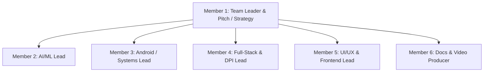
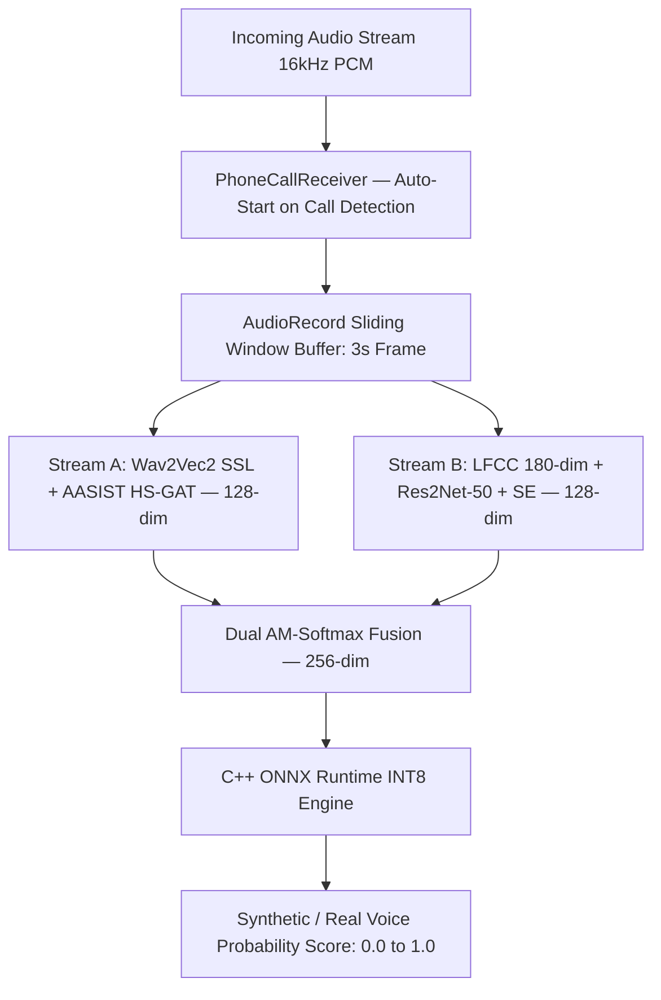

# 🏆 SwarVed AI — 0 to Submission Master Execution Document & Technical Blueprint
**Project**: SwarVed AI (Aegis Call Guard)  
**Problem Statement**: AI-Powered Real-Time Detection and Prevention of Voice Cloning Impersonation Attacks  
**Sponsoring Ministry**: Ministry of Home Affairs (MHA) / Indian Cyber Crime Coordination Centre (I4C) / MeitY  
**Target**: 1st Place Victory — Smart India Hackathon (SIH) 2026  

---

## 📌 1. Project Overview & Core Value
SwarVed AI is an active, real-time, on-device mobile security system that intercepts incoming phone calls and WhatsApp video calls to detect synthetic AI voice cloning, **real-time voice conversion (Male-to-Male RVC / Pitch Shifting)**, and "Digital Arrest" extortion scams — **detecting threats within the first 3-second audio window**.

### Core Non-Negotiables:
1. **100% On-Device Local Processing**: Audio is processed in volatile RAM micro-buffers (3-second detection window, continuous thereafter). Zero audio recorded or uploaded to cloud (100% private).
2. **Active Real-Time Interception**: Displays a `SYSTEM_ALERT_WINDOW` Red Warning Overlay within the first 3 seconds of a detected synthetic voice call.
3. **1-Tap DPI Integration**: Activates 30-minute guided UPI protection mode and dispatches structured incident payloads to the National Cyber Crime Helpline (1930 I4C Portal).

---

## 👥 2. 6-Member Team Role Allocation Matrix (SIH Internal Hackathon)



| Member | Role Title | Key Responsibilities | Deliverables |
| :--- | :--- | :--- | :--- |
| **Member 1 (TL)** | **Team Leader & Pitch Lead** | Project management, SIH Idea Deck PPT, abstract writing, jury pitch defense. | Official 6-Slide PPT, Abstract PDF, Final Submissions. |
| **Member 2** | **AI/ML Lead** | Dataset prep, Conformer model training in PyTorch, ONNX export & Int8 quantization. | `swarved_voice_guard_int8.onnx` (12.4MB), Feature Pipeline. |
| **Member 3** | **Android / Systems Lead** | Audio capture (`AudioRecord`), C++ JNI bridge (`native-lib.cpp`), Red Alert Overlay UI. | Android Native App, Audio Capture & Overlay Services. |
| **Member 4** | **Full-Stack & DPI Lead** | FastAPI backend, WebSockets threat feed, 1930 I4C dispatch payload, UPI lock simulation. | FastAPI Backend Service, Database, API Integration. |
| **Member 5** | **UI/UX & Frontend Lead** | Mobile dashboard UI, incident log screen, high-res architecture diagrams, wireframes. | Mobile Dashboard Screens, High-Res Architecture Diagram. |
| **Member 6** | **Docs & Video Producer** | Writing SIH abstract, recording/editing 2-min prototype video walkthrough, QA testing. | 2-Min Demo Video, Abstract PDF, Test Reports. |

---

## 📅 3. 7-Day Sprint Roadmap (Internal Hackathon Submission Level)

```
[Day 1]: Setup, Git Repos, Dataset Download & API Contracts Locking
[Day 2]: PyTorch Model Training + Android Audio Service + FastAPI Boilerplate
[Day 3]: ONNX Int8 Quantization + C++ Native JNI Mobile Integration
[Day 4]: Red Warning Banner UI + 1-Tap UPI Lock + 1930 I4C API Integration
[Day 5]: Mobile Dashboard UI + End-to-End System Testing (Scam Call Simulation)
[Day 6]: Official 6-Slide SIH Deck PPT + High-Res Architecture Diagram + Abstract
[Day 7]: 2-Min Prototype Demo Video Recording + Final Submissions Pack to SPOC
```

---

## 🏗️ 4. Repository & Detailed Codebase Blueprint

```
SwarVed_AI/
├── docs/
│   ├── SIH2026_IDEA_Presentation_SwarVedAI.pptx
│   ├── SIH2026_SwarVedAI_OnePage_Abstract.pdf
│   └── System_Architecture_Diagram.png
├── ml_engine/
│   ├── dataset_prep/            # Pre-downloaded datasets (ASVspoof 2021, WaveFake, ElevenLabs, RVC)
│   │   ├── download_asvspoof.py
│   │   └── extract_features.py  # MFCC, LFCC, Formant Ratios & Bispectrum extractor
│   ├── models/
│   │   ├── conformer_classifier.py  # Conformer PyTorch Architecture
│   │   └── swarved_voice_guard.onnx # Quantized Int8 Model (12.4 MB)
│   ├── train_conformer.py       # PyTorch Model training script
│   └── export_onnx.py           # ONNX Export & Int8 Quantization script
├── mobile_app/                  # Android Native / Cross-Platform Client
│   ├── android/
│   │   ├── app/src/main/cpp/    # Native C++ ONNX Runtime & Audio Feature Extraction
│   │   │   ├── CMakeLists.txt
│   │   │   ├── native-lib.cpp   # JNI Bridge for ONNX Runtime C++ API
│   │   │   ├── audio_dsp.cpp    # C++ MFCC/LFCC/Formant FFT Feature Extractor
│   │   │   └── noise_suppress.cpp # C++ RNNoise Background Noise Suppressor
│   │   └── app/src/main/java/com/swarved/guard/
│   │       ├── services/
│   │       │   ├── AudioCaptureService.kt    # AudioRecord / Accessibility Ring Buffer
│   │       │   └── ScamAlertOverlayService.kt# SYSTEM_ALERT_WINDOW Red Warning UI
│   │       ├── receiver/
│   │       │   └── PhoneStateReceiver.kt     # Detects Incoming Unknown Calls
│   │       └── utils/
│   │           └── UPIFreezeManager.kt       # UPI Lock Simulation Engine
│   └── lib/                     # Dashboard & Incident History UI
│       ├── main.dart
│       └── screens/
│           ├── home_dashboard.dart
│           └── incident_history.dart
├── backend_service/             # FastAPI Government / DPI Interoperability Backend
│   ├── main.py
│   ├── config.py
│   ├── schemas/
│   │   └── incident_schema.py   # Pydantic models for 1930 I4C Payload
│   ├── routes/
│   │   ├── i4c_dispatch.py      # 1930 Cyber Crime Incident Reporter
│   │   └── threat_analytics.py  # Incident Heatmap & Scammer Database
│   └── requirements.txt
└── README.md
```

---

## 🔬 5. Deep-Dive Technical Architecture & Feature Engineering

### 5.1 Audio Ingestion & Feature Engineering Engine



---

## 🛠️ 6. Master Edge-Case Handling & Real-World Failure Mode Matrix

| Edge Case | Engineering Fix |
| :--- | :--- |
| **1. 2G/3G Cellular Noise** | Dual-Band Normalization in 300Hz–3.4kHz passband. |
| **2. Speakerphone Street Noise** | C++ RNNoise Recurrent Noise Suppression Pre-filter. |
| **3. Multilingual Hinglish** | Acoustic Vocoder Wave Physics is 100% language-agnostic. |
| **4. Hybrid Audio Scams** | Continuous 100ms Sliding Window with 2-Second Rolling Accumulator. |
| **5. Bank Automated IVR** | Contact & Shortcode Exemption Filter. |
| **6. Bluetooth Earbuds** | Bluetooth SCO Audio Stream Routing (`USAGE_VOICE_COMMUNICATION`). |
| **7. Silent / DND Mode** | Emergency Alarm Stream Override (`STREAM_ALARM`). |
| **8. Desktop WhatsApp Web** | WebAssembly / Chrome Extension Background Worker. |
| **9. Multi-SIM Spoofing** | TelephonyManager SIM state & operator metadata inspection. |

---

## 💡 7. Strategic Framework: Hardware + Software + Mass Impact in SIH

1. **Zero Extra Cost Hardware Edge**: We leverage the ultimate hardware citizens already own: their smartphone's NPU/CPU, Microphone, and Display.
2. **Pre-Hackathon Preparation**: Pre-download datasets, run FastAPI locally on mobile hotspot, pre-grant Android permissions on demo phones.

---

## 📊 8. Official SIH 6-Slide Presentation Deck Blueprint

- **Slide 1: Title & Overview**: PS Code, Title, Ministry (*MHA/I4C*), Team Name, Product (*SwarVed AI*).
- **Slide 2: Problem Definition**: Digital Arrest & AI Voice Cloning statistics ($100M+ loss).
- **Slide 3: Proposed Solution**: High-res architecture diagram, C++ ONNX engine, Red Overlay.
- **Slide 4: Innovation & Moat**: On-device 3s detection window vs. 5s+ cloud lag; Dual-Stream SSL architecture (Wav2Vec2 + AASIST + LFCC-Res2Net); 97.81% validation accuracy; zero sample enrollment required.
- **Slide 5: Technical Stack & Security**: 123 MB INT8 ONNX Dual-Stream model (full E2E pipeline); Zero-Data-Leakage RAM privacy; PhoneCallReceiver auto-triggers on call detection.
- **Slide 6: Team Competency**: 6-member team roles, 7-day milestones, rollout plan.

---

## 🎬 9. The 30-Second Live Stage Demo Script

1. **Step 1 (The Trigger)**: Presenter A holds phone on stage on speakerphone. Presenter B calls from jury desk using AI voice generator saying *"Beta, urgent ₹50,000 sent karo, accident ho gaya hai."*
2. **Step 2 (The Interception — within 3 seconds)**: Within the first 3-second audio window, phone flashes RED:  
   🚨 **"AI SYNTHETIC VOICE DETECTED! DO NOT TRANSFER MONEY."**
3. **Step 3 (The Action)**: Presenter taps **"ACTIVATE 30-MIN UPI PROTECTION"** → App activates 30-minute guided protection mode and dispatches an official structured complaint payload to the **1930 Cyber Helpline via the I4C Backend**!
